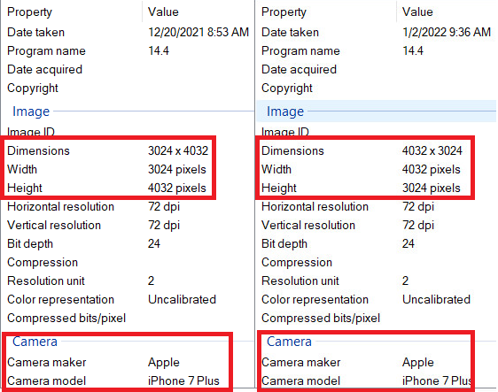
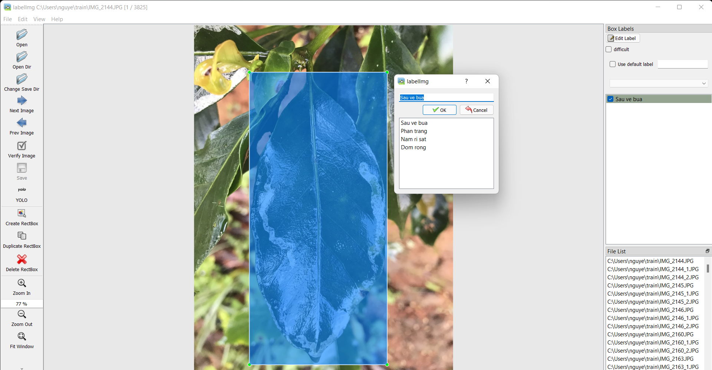

# XÂY DỰNG BỘ DỮ LIỆU
* ### Quá trình thu thập:
    * Dữ liệu được nhóm thu thập thủ công bằng camera của điện thoại.
    * Điện thoại sử dụng: Iphone 7 Plus, 32GB.
    * Mỗi tấm ảnh gốc có kích thước 3024 x 4032 (camera nằm ngang), 4032 x 3024 (camera nằm dọc)

        

        
         
        <a style="text-align: center">Hình 6. Độ phân giải và camera sử dụng.</a>
        

    * File ảnh được lưu trữ trong cùng 1 folder trên máy tính dưới dạng tệp .JPG

    * Thời gian thu thập dữ liệu:

| STT | Thời gian thu thập | Địa điểm thu thập |
| :---: | --- | --- |
| 1 | 20/12/2021 | Huyện Lạc Dương |
| 2 | 25/12/2021 | Xã Trạm Hành |
| 3 | 1/2/2022 | Xã Trạm Hành |

* ### Tiêu chí khi thu thập dữ liệu :

    * Chụp rõ nét tập trung vào lá cây bị bệnh.
    * Chụp toàn bộ chiếc lá từ phần cuốn lá đến chóp lá.
    * Đảm bảo ánh sáng ban ngày.
    
* ### Giảm độ phân giải của ảnh :

    * Do mỗi ảnh có kích thước khá lớn nên dung lượng lưu trữ khá nặng. Đối với folder chứa toàn bộ dữ liệu gốc nặng khoảng 11.2 Gb gây khó khăn trong việc lưu trữ nến nhóm đã giảm độ phân giải xuống ~ 3.33 lần. Độ phân giải sau khi giảm 907 x 1209 và 1209 x 907. Dung lượng lưu trữ sau khi xử lý nặng khoảng 1.6 Gb.

* ### Gán nhãn dữ liệu :

    * Sử dụng công cụ labelImg để tiến hành gán nhãn toàn bộ dữ liệu
        

        
         
        <a style="text-align: center">Hình 7. Công cụ labelImg.</a>
        

    * Sử dụng thao tác kéo thả chuột để tạo bouding box cho đối tượng. Label được lưu thành file text có cùng tên với ảnh dưới dạng YOLO format.
            

            
             
            <a style="text-align: center">Hình 8. Ảnh, label và label format của YOLO.</a>
            

    * Trong một ảnh có thể có nhiều lá những chỉ label những lá bị bệnh và thấy rõ từ cuốn lá đến chóp lá.

    * Số loại label là 4. Được kí hiệu bằng 1 trong các chữ số 0, 1, 2, 3

* ### Cách sử dụng dataset :

* Tập dữ liệu được chia thành hai tập train và test với tỉ lệ là 80% cho tập train và 20% cho tập test
    

    
     
    <a style="text-align: center">Hình 15. Số lượng object thuộc từng loại label trong tập train.</a>
    

    

    
     
    <a style="text-align: center">Hình 16. Số lượng object thuộc từng loại label trong tập test.</a>
    

    Trong đó:  
        0 : Sâu vẽ bùa  
        1 : Phấn trắng  
        2 : Nấm rỉ sắt  
        3 : Đốm rong  

* Dataset được tổ chức lưu trữ trên roboflow. Sử dụng code để tải dataset về trong quá trình train và test