

  

<h1 align="center">
    
  **BÁO CÁO ĐỒ ÁN CUỐI KỲ**
  
  **PHÁT HIỆN MỘT SỐ BỆNH TRÊN LÁ CÂY CÀ PHÊ**

</h1>

* **Giáo viên hướng Dẫn** :

| STT | Họ tên | Email |
| :---: | --- | --- |
| 1 | **PGS.TS. Lê Đình Duy** | *duyld@uit.edu.vn* |
| 2 | **Ths. Phạm Nguyễn Trường An** | *truonganpn@uit.edu.vn* |

* **Giới thiệu thành viên nhóm**
<!-- ### Thông tin liên hệ -->
| STT | MSSV | Họ tên | Gmail |
|:--- | :-------|:----------|:------------|
|1|19521322|Huỳnh Ngọc Công Danh|19521322@gm.uit.edu.vn|
|2|19522524|Nguyễn Phú Vinh| 19522524@gm.uit.edu.vn|
|3|19521858|Võ Tuấn Minh|19521858@gm.uit.edu.vn|

[0]:https://github.com/danhhuynh25029
[2]:https://github.com/minh1304
[1]:https://github.com/phuvinh010701
[3]:https://www.facebook.com/danh250/
[4]:https://www.facebook.com/phuvinh0107
[5]:https://www.facebook.com/tuanminh.vo.73

## Bảng mục lục
Chương 1.[Tổng quan](#giới-thiệu-bài-toán:)

Chương 2.[Các nghiên cứu trước](#xây-dựng-bộ-dữ-liệu:)

Chương 3.[Xây dựng bộ dữ liệu](#mô-hình-sử-dụng:)

Chương 4.[Training và đánh giá model](#phương-pháp-đánh-giá:)

Chương 5.[Ứng dụng và hướng phát triển](#đánh-giá-kết-quả:)

# Chương 1. TỔNG QUAN

## 1.1 Mô tả bài toán

* Ngữ cảnh ứng dụng : 
    
    * Hiện nay, cà phê là một trong những loại thức uống được sử dụng phổ biến lẫn trong và ngoài nước. Cà phê được sản xuất từ những hạt cà phê rang, lấy trên cây cà phê.

    

    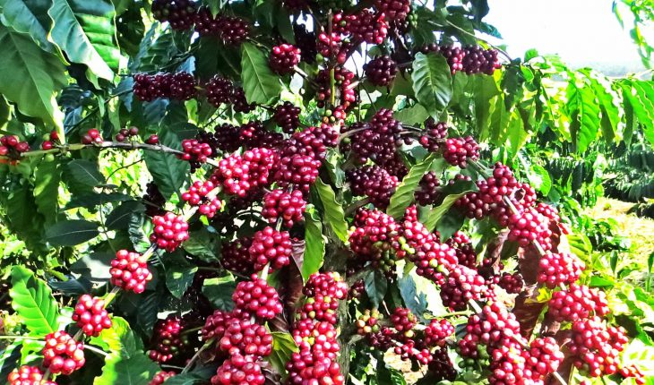
     
    <a style="text-align: center">Hình 1. Ảnh minh họa (Nguồn: Internet).</a>
    

    * Theo báo điện tử VTV, trên 90% tổng sản lượng cà phê của Việt Nam dành cho việc xuất khẩu, khoảng 10% còn lại là dành cho việc chế biến và tiêu thụ trong nước. Cà phê nằm trong nhóm hàng nông sản xuất khẩu chủ lực của Việt Nam, hiện đứng thứ 2 thế giới (chỉ sau Brazil). Tính chung cả năm 2021, xuất khẩu cà phê của Việt Nam đạt 1,52 triệu tấn.

    

    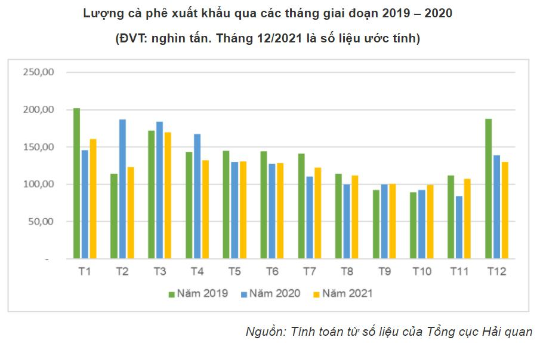
     
    <a style="text-align: center">Hình 2. Lượng cà phê xuất khẩu qua các tháng giai đoạn từ 2019-2021.</a>
    

    * Sản lượng tuy lớn nhưng cà phê vẫn chưa đáp ứng được các tiêu chuẩn về chất lượng. Nhằm nâng cao chất lượng của hạt cà phê, việc phát hiện và xử lý những căn bệnh trên lá của cây rất quan trọng. Nhận thấy được vấn đề đó nên nhóm đã quyết định áp dụng những kiến thức của mình và những công nghệ trong lĩnh vực Machine Learning để giải quyết bài toán phát hiện một số loại bệnh trên lá cây cà phê.

    * Mô hình hướng tới người sử dụng là người trồng cây cà phê, xây dựng một ứng dụng có thể giúp người trồng có thể phát hiện chính xác hơn các loại bệnh đang gặp trên lá của cây và đưa ra được giải pháp phù hợp nhằm loại bỏ bệnh và tác nhân gây bệnh. 
    
* Input và Output:
    
    * Input:
        
        * Một tấm ảnh chụp hình lá của cây cà phê đang bị bệnh.

        

        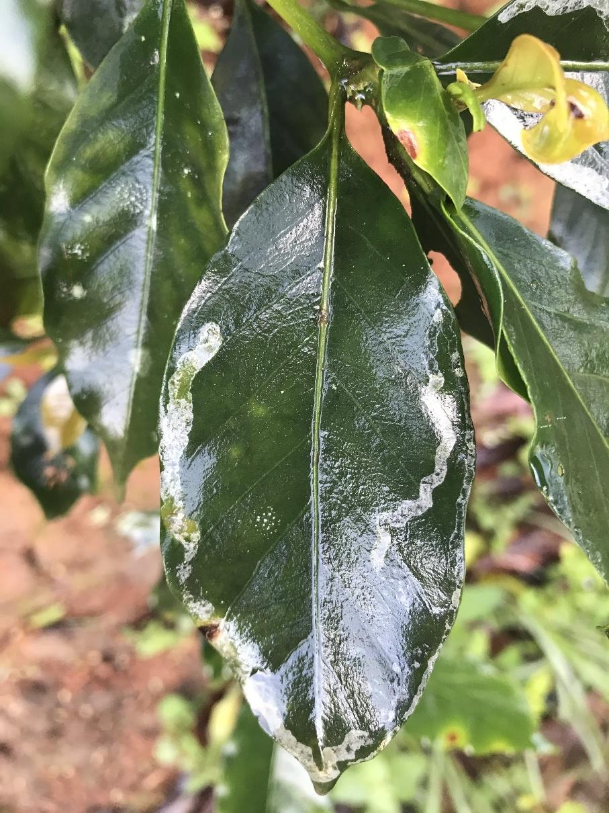
         
        <a style="text-align: center">Hình 3. Ví dụ về ảnh input thích hợp.</a>
        

        * Các điều kiện ràng buộc :
            + Ảnh chụp tập trung vào lá đang bị bệnh
            + Chụp được từ cuốn lá đến chóp lá
            + Chụp trong điều kiện ánh sáng ban ngày
            
    * Output:

        * Bounding box bao quanh lá cây bị bệnh
        * Tên loại bệnh
     
    🠊 Trong ứng dụng thực tế hoàn chỉnh, dựa vào tên loại bệnh xác định được ứng dụng sẽ đưa ra các giải pháp phù hợp cho người trồng

## 1.2 Mô tả dữ liệu
* Dữ liệu của bài toán đươc nhóm tự thu thập từ mốt số vườn chuyên trồng cà phê trên địa bàn huyện Lạc Dương và địa bàn thành phố Đà Lạt thuộc tỉnh Lâm Đồng. Trong quá trình thu thập dữ liệu, nhóm gặp nhiều khó khăn như việc di chuyển đến các vườn cà phê khá xa so với nhà riêng (khoảng hơn 20 km), dịch bệnh COVID-19 khiến cho việc đi qua các chốt phong tỏa khó khăn.
    

    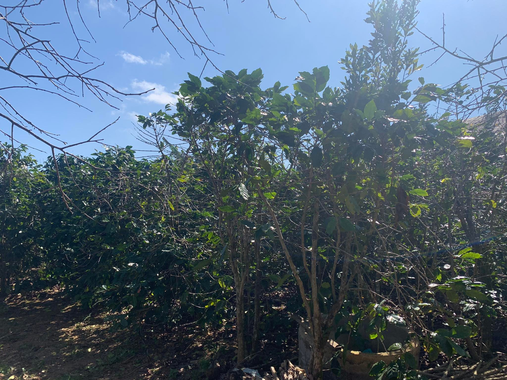
     
    <a style="text-align: center">Hình 4. Vườn cà phê thuộc xã Trạm Hành, thành phố Đà Lạt, tỉnh Lâm Đồng.</a>
    

* Bộ dữ liệu về lá cây cà phê hiện nay chưa có ai thu thập nên số lượng dữ liệu mà nhóm có vẫn còn hạn chế do dữ liệu tự thu thập và xử lý. Mục đích của việc tự thu thập dữ liệu là để phù hợp với ngữ cảnh ứng dụng của bài toán.

# Chương 2. CÁC NGHIÊN CỨU TRƯỚC
* Bài toán của nhóm đặt ra là muốn hướng đến bài toán thuộc loại Object Detection (Phát hiện đối tượng), định vị đối tượng trong ảnh và xác định đối tượng thuộc loại nào. Trong lĩnh vực thị giác máy tính thì bài toàn phát hiện đối tượng đạt được nhiều kết quả khi áp dụng hướng tiếp cận Deep learning. Có thể kể đến một số hướng tiếp cận tiên tiến hiện nay bao gồm RCNN, Fast RCNN, Faster RCNN, Mask RCNN, RetinaNet, YOLO, v.v
* Faster RCNN
    * Phương pháp Faster RCNN là một trong các phương pháp phát hiện đối tƣợng sử dụng mạng Deep learning đạt độ chính xác cao trên các tập dữ liệu chuẩn như COCO . Faster RCNN được cải tiến dựa trên 2 phương pháp trướcc đó là RCNN và Fast RCNN.
* Mask RCNN
    * Phương pháp Mask RCNN là phương pháp thực hiện song song 2 bài toán là phân vùng đối tượng (Instance Segmentation) và phát hiện đối tượng. Mask RCNN là phương pháp được cải tiến từ Faster RCNN.
* Restinanet
    * RetinaNet là một phƣơng pháp tiếp cận one-stage tức là ngay trong bản thân cấu trúc mạng của phƣơng pháp đã bao gồm thao tác đưa ra vùng đề xuất
* YOLO
    * YOLO được xem là phương pháp đầu tiên xử lý dữ liệu theo thời gian thực và vẫn đạt được độ chính xác cao.
* Một số kết quả nghiên cứu được đánh giá trên tập COCO. COCO (Common Objects in Context) là một tập datasets phục vụ cho các bài toán Object Detection, Segmentation, Image Captioning. Tập dữ liệu tổng cộng có khoảng 1.5 triệu object thuộc về 80 class khác nhau.
    

    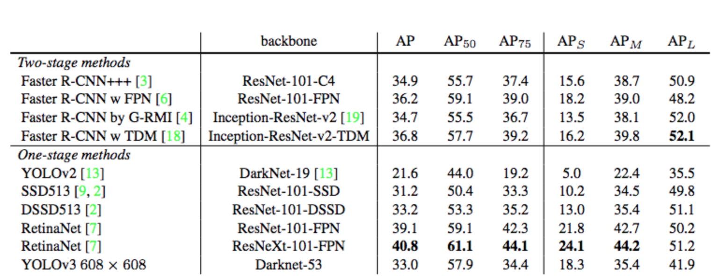
     
    <a style="text-align: center">Hình 5. Perfomance trên tập COCO.</a>
    

# Chương 3. XÂY DỰNG BỘ DỮ LIỆU
* ### Quá trình thu thập:
    * Dữ liệu được nhóm thu thập thủ công bằng camera của điện thoại.
    * Điện thoại sử dụng: Iphone 7 Plus, 32GB.
    * Mỗi tấm ảnh gốc có kích thước 3024 x 4032 (camera nằm ngang), 4032 x 3024 (camera nằm dọc)

        

        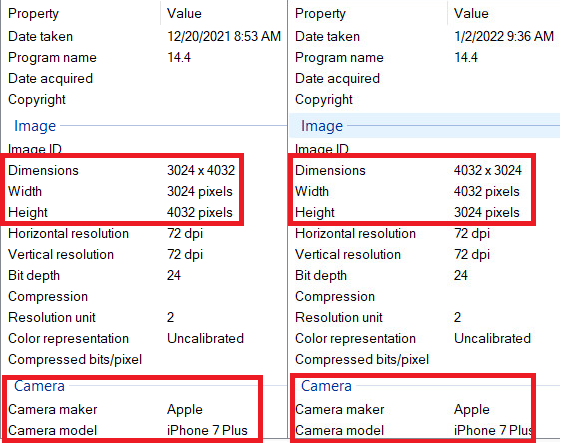
         
        <a style="text-align: center">Hình 6. Độ phân giải và camera sử dụng.</a>
        

    * File ảnh được lưu trữ trong cùng 1 folder trên máy tính dưới dạng tệp .JPG

    * Thời gian thu thập dữ liệu:

| STT | Thời gian thu thập | Địa điểm thu thập |
| :---: | --- | --- |
| 1 | 20/12/2021 | Huyện Lạc Dương |
| 2 | 25/12/2021 | Xã Trạm Hành |
| 3 | 1/2/2022 | Xã Trạm Hành |

* ### Tiêu chí khi thu thập dữ liệu :

    * Chụp rõ nét tập trung vào lá cây bị bệnh.
    * Chụp toàn bộ chiếc lá từ phần cuốn lá đến chóp lá.
    * Đảm bảo ánh sáng ban ngày.
    
* ### Giảm độ phân giải của ảnh :

    * Do mỗi ảnh có kích thước khá lớn nên dung lượng lưu trữ khá nặng. Đối với folder chứa toàn bộ dữ liệu gốc nặng khoảng 11.2 Gb gây khó khăn trong việc lưu trữ nến nhóm đã giảm độ phân giải xuống ~ 3.33 lần. Độ phân giải sau khi giảm 907 x 1209 và 1209 x 907. Dung lượng lưu trữ sau khi xử lý nặng khoảng 1.6 Gb.

* ### Gán nhãn dữ liệu :

    * Sử dụng công cụ labelImg để tiến hành gán nhãn toàn bộ dữ liệu
        

        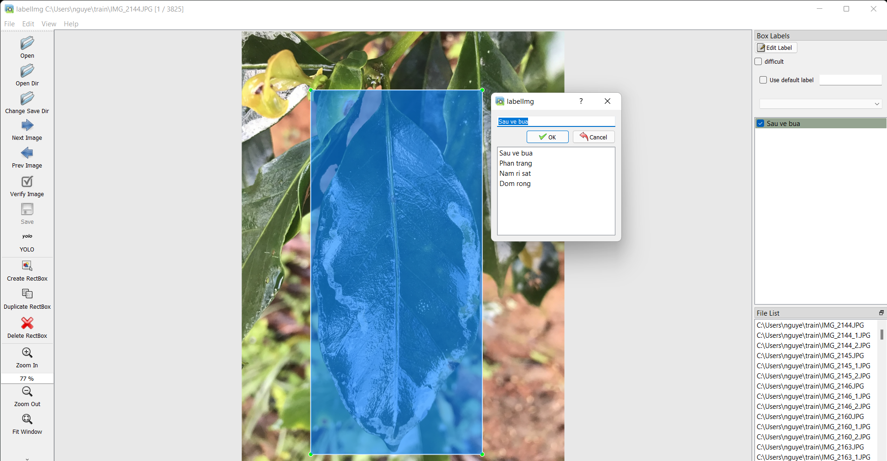
         
        <a style="text-align: center">Hình 7. Công cụ labelImg.</a>
        

    * Sử dụng thao tác kéo thả chuột để tạo bouding box cho đối tượng. Label được lưu thành file text có cùng tên với ảnh dưới dạng YOLO format.
            

            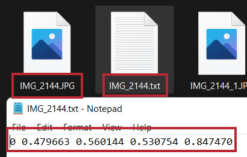
             
            <a style="text-align: center">Hình 8. Ảnh, label và label format của YOLO.</a>
            

    * Trong một ảnh có thể có nhiều lá những chỉ label những lá bị bệnh và thấy rõ từ cuốn lá đến chóp lá.

    * Số loại label là 4. Được kí hiệu bằng 1 trong các chữ số 0, 1, 2, 3

    ***Label 0: Bệnh sâu vẽ bùa***
    
    * Những lá bị sâu vẽ bùa gây hại sẽ bị co lại, biến dạng. Sâu non chui qua lớp biểu bì của lá để ăn phần nhu mô của lá tạo thành đường hầm ngoằn ngoèo màu trắng, trắng đục dưới lớp biểu bì.
        
    

    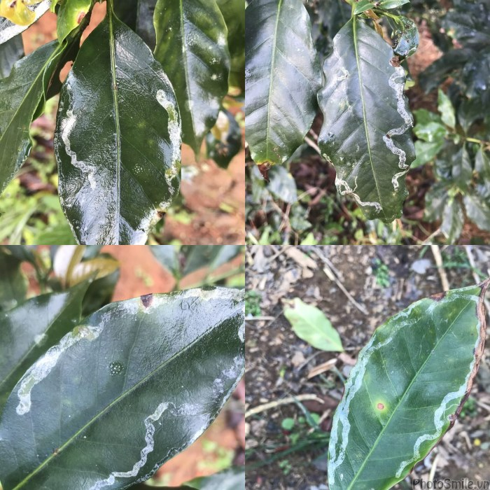
     
    <a style="text-align: center">Hình 9. Một số ví dụ về bệnh sâu vẽ bùa trên lá cà phê.</a>
    

    ***Label 1: Bệnh phấn trắng***
    
    * Bệnh phấn trắng do một số loại nấm có họ hàng gần gây ra. Triệu chứng chung là chúng tạo ra lớp bột có màu trắng xám trên bề mặt của lá.
        
    

    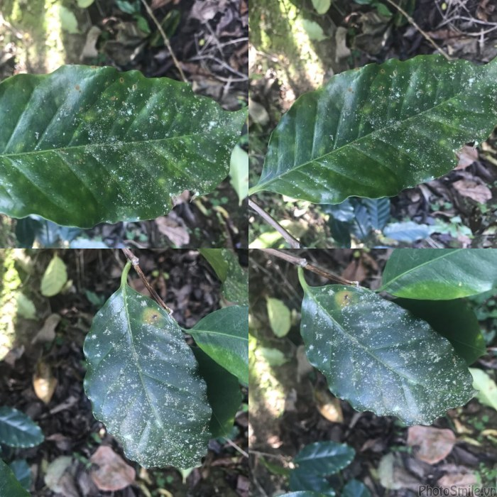
     
    <a style="text-align: center">Hình 10. Một số ví dụ về bệnh phấn trắng trên lá cà phê.</a>
    

    ***Label 2: Bệnh nấm rỉ sắt***
    
    * Trên lá xuất hiện các vết đốm hình tròn màu nâu cam hơi đỏ (giống rỉ sắt), xung quanh có vầng màu vàng úa.
        
    

    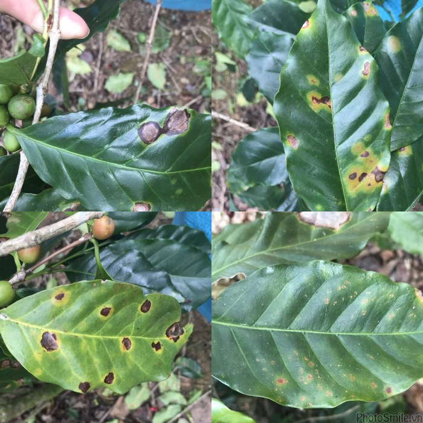
     
    <a style="text-align: center">Hình 11. Một số ví dụ về bệnh nấm rỉ sắt trên lá cà phê.</a>
    

    ***Label 3: Bệnh đốm rong***
    
    *  Đốm bệnh có hình tròn lúc đầu nhỏ khoảng 3 - 5 mm, hơi nhô lên trên mặt lá do rong phát triển thành ung mịn, màu hơi vàng.
        
    

    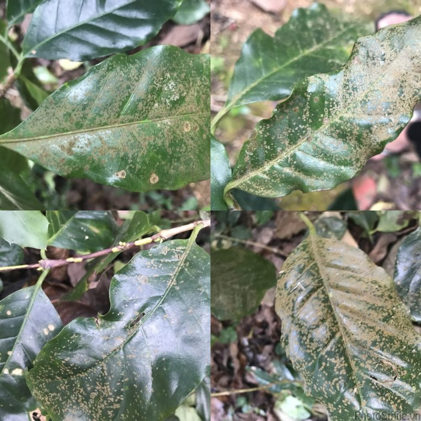
     
    <a style="text-align: center">Hình 12. Một số ví dụ về bệnh đốm rong trên lá cà phê.</a>
    

* ### Thống số bộ dữ liệu :
    * Tổng số lượng ảnh trong bộ dữ liệu là 3825 ảnh
    * Tổng số object là 4092

    

    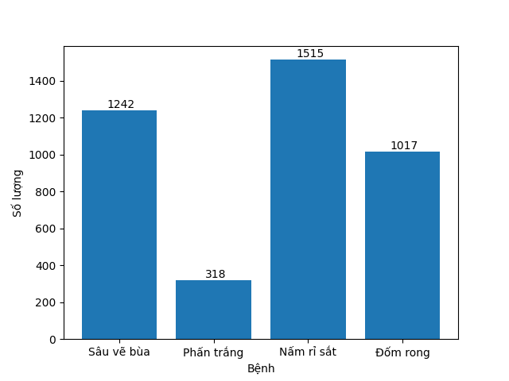
     
    <a style="text-align: center">Hình 13. Số lượng object thuộc từng loại label.</a>
    

    
    **Nhận xét :** Số lượng label thuộc bệnh phấn trắng khá ít so với các bệnh khác, nguyên nhân là bệnh này xuất hiện khá ít tại các vườn cà phê thu thập dữ liệu.

    * Tập dữ liệu được chia thành hai tập train và test với tỉ lệ là 80% cho tập train và 20% cho tập test
    

    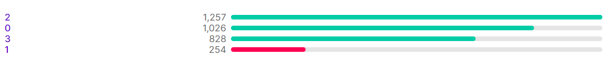
     
    <a style="text-align: center">Hình 14. Số lượng object thuộc từng loại label trong tập train.</a>
    

    

    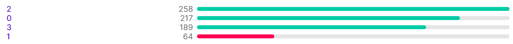
     
    <a style="text-align: center">Hình 15. Số lượng object thuộc từng loại label trong tập test.</a>
    

    Trong đó:  
        0 : Sâu vẽ bùa  
        1 : Phấn trắng  
        2 : Nấm rỉ sắt  
        3 : Đốm rong  
# Chương 4. TRAINING VÀ ĐÁNH GIÁ MODEL
## Cấu hình train và test:

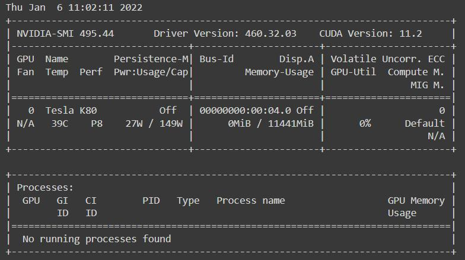
 
<a style="text-align: center">Hình 16. Cấu hình dùng để train và test.</a>

## YOLOv4:

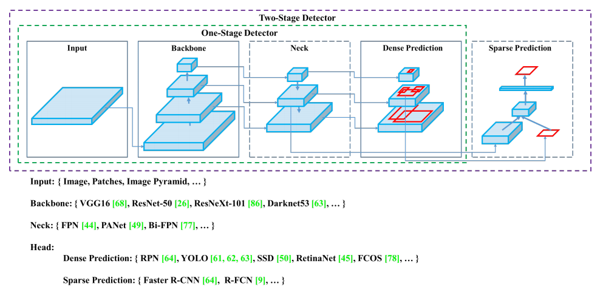
 
<a style="text-align: center">Hình 16. Cấu trúc mô hình YOLOv4.</a>

### Sơ lược về YOLOv4

* YOLOv4 là một loạt các cải tiến về tốc độ so với YOLOv3 và được cài đặt từ một bản fork của Darknet. Kiến trúc của YOLOv4 đã đưa bài toán object detection dễ tiếp cận hơn với những người không có tài nguyên tính toán mạnh.

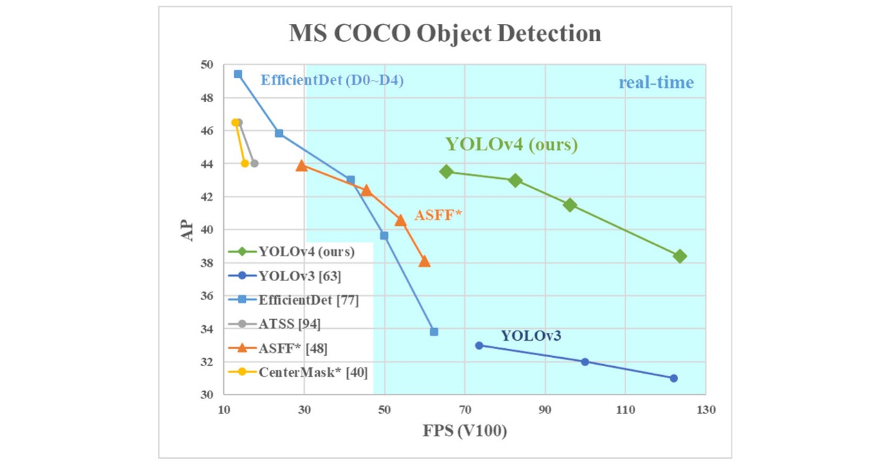
 
<a style="text-align: center">Hình 17. So sánh YOLOv4 với các mô hình khác.</a>

* Kết quả so sánh YOLOv4 với các mô hình khác ở thời điểm hiện tại. YOLOv4 chạy nhanh gấp đôi EfficientDet và tăng AP và FPS so với YOLOv3 lần lượt là 10% và 12%. Hình ảnh từ paper YOLOv4. Nhìn vào biểu đồ, ta dễ dàng thấy được sự hiệu quả của YOLOv4 so với các mạng tốt nhất hiện nay. Cụ thể hơn YOLOv4 đạt 43.5% AP trên tập dữ liệu MS COCO ở tốc độ 65 FPS, trên GPU Tesla V100. 

### Thiết lập training

* Để train model nhóm sử dụng tài nguyên của Google Colab với thiết lập runtime type là GPU

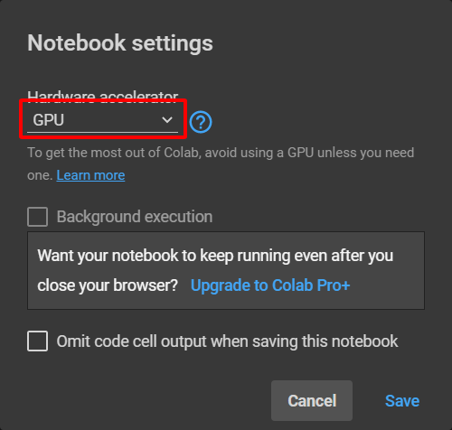
 
<a style="text-align: center">Hình 18. Bật GPU trên Google Colab.</a>

* Nhóm sử dụng darknet repository của tác giả để huấn luyện cho model và thiết lập các thông số trong file Makefile như sau

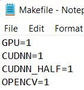
 
<a style="text-align: center">Hình 19. Thiết lập các thông số Makefile để sử dụng GPU.</a>

* Chỉnh sửa các thông số của model YOLOv4 trong file yolov4-custom.cfg theo hướng dẫn của tác giả:
    * batch: 32
    * subdivisions = 32
    * max_batches = 8000 (Bằng số class * 2000)
    * steps = 6400, 7200 (Bằng 0.8 * max_batches, 0.9 * max_batches)
    * width = 416, height = 416 (Kích thước của ảnh)
    * classes = 4 (Số class)
    * filters = 27 (Tính theo công thức filters = (classes + 5) * 3) 

* Tạo file train.txt chứa đường dẫn tới các ảnh dùng để train (3138 ảnh)

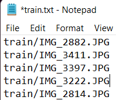
 
<a style="text-align: center">Hình 20. File train.txt</a>

* Tạo file valid.txt chứa đường dẫn tới các ảnh dùng để đánh giá trong quá trình train (687 ảnh)

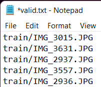
 
<a style="text-align: center">Hình 21. File valid.txt</a>

* Tạo file obj.names chứa tên của các class

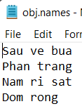
 
<a style="text-align: center">Hình 22. File obj.names</a>

* Tạo file obj.data có nội dung như sau

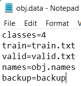
 
<a style="text-align: center">Hình 23. File obj.data</a>

    Trong đó:
    classes: là số lượng class
    train: đường dẫn tới file train.txt
    valid: đường dẫn tới file valid.txt
    names: đường dẫn tới file obj.names
    backup: đường dẫn tới folder backup chứa các trọng số được lưu lại trong quá trình train

### Train model
* Tải file trọng số yolov4.conv.137.weights và tiến hành train trên file trọng số này
* Trong quá trình train model các file trọng số được lưu lại tronng đó có 2 file quan trọng là:
    * yolov4-custom_last.weights (Trọng số của interation mới nhất)
    * yolov4-custom_best.weights (Trọng số tốt nhất)
* Quá trình training khá lâu vượt qua thời gian cho phép của Google Colab nên ở những lần train tiếp theo nhóm tiến hành train tiếp trên file trọng số mới nhất
* Thời gian train model: khoảng 28 tiếng
* Thời gian test trên 686 ảnh: 53 giây 

## YOLOv5:

### Sơ lược về YOLOv5
* Không lâu sau khi YOLOv4 được phát hành chính thức thì 1 phiên bản khác của YOLO xuất hiện là YOLOv5 sử dụng frame work Pytorch. Với những số liệu của tác giả cung cấp thì mô hình này khá triển vọng. Tuy nhiên YOLOv4 hiện vẫn chưa có paper chính thức.

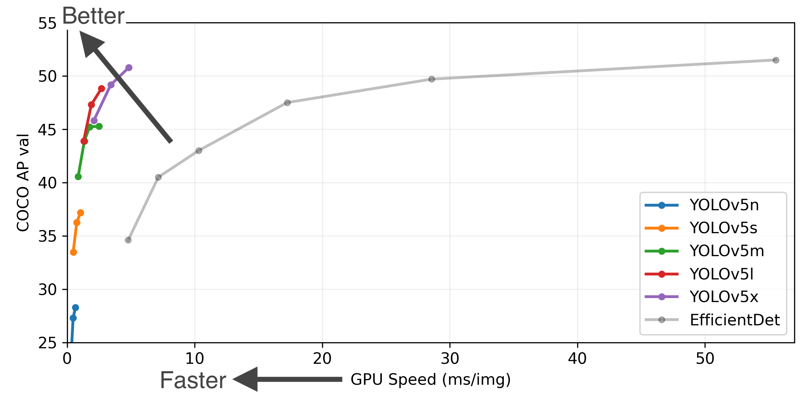
 
<a style="text-align: center">Hình 24. Perfomance của các phiên bản YOLOv5 trên tập COCO</a>

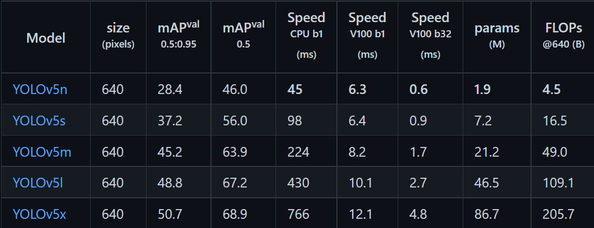
 
<a style="text-align: center">Hình 25. Kết quả đánh giá trên tập COCO</a>

* Từ những kết quả mà tác giả đưa ra có thể thấy YOLOv5 có thể đạt tới 68.9% mAP0.5 trên tập COCO.

### Thiết lập training
* Tạo file data.yaml có nội dung như sau

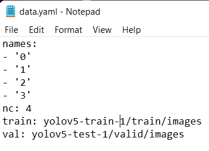
 
<a style="text-align: center">Hình 26. File data.yaml</a>

    Trong đó:
    names: lần lượt là tên của các label được đặt trong dấu ngoặc kép
    nc: số lượng class
    train: đường dẫn tới các file ảnh train
    valid: đường dẫn tới các file ảnh dùng để valid trong quá trình train

* Thiết lập training
    * batch: 32
    * img size: 416
    * epoch: 500

### Train model
* Tải file trọng số của model YOLOv5s và tiến hành train trên file trọng số này.
* Trong quá trình train model các file trọng số được lưu lại tronng đó có 2 file quan trọng là:
    * last.pt (Trọng số của epoch mới nhất)
    * best.pt (Trọng số tốt nhất)
* Quá trình training khá lâu vượt qua thời gian cho phép của Google Colab nên ở những lần train tiếp theo nhóm tiến hành train tiếp trên file trọng số mới nhất
* Vào epoch 450 thì xuất hiện thông báo dừng train model như sau:

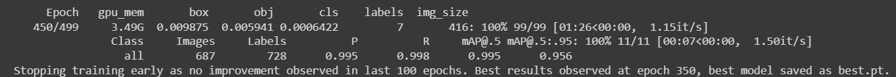
 
<a style="text-align: center">Hình 27. Early stopping YOLOv5</a>

* Do trong 100 epoch gần nhất thì model không còn tốt lên được nữa (model hội tụ) nên tự động dừng train.
* Thời gian train model: khoảng 8 tiếng
* Thời gian test trên 686 ảnh: 32 giây

## Faster-RCNN:

## Đánh giá model

* Thiết lập các ngưỡng để đánh giá
    * confidence thresh: 0.25
    * iou thresh: 0.5

| Model | Precision | Recall | mAP0.5 |
| :---: | --- | --- | --- |
| YOLOv4 | 0.90 | 0.98 | 0.989 |
| YOLOv5s | 0.988 | 0.99 | 0.995 |
## Chướng 5. Ứng dụng và hướng phát triển:

## Tài liệu tham khảo:
Danh & Vinh
