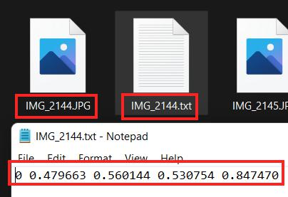

  

<h1 align="center">
    
  **BÁO CÁO ĐỒ ÁN CUỐI KỲ**
  
  **PHÁT HIỆN MỘT SỐ BỆNH TRÊN LÁ CÂY CÀ PHÊ**

</h1>

* **Giáo viên hướng Dẫn** :

| STT | Họ tên | Email |
| :---: | --- | --- |
| 1 | **PGS.TS. Lê Đình Duy** | *duyld@uit.edu.vn* |
| 2 | **Ths. Phạm Nguyễn Trường An** | *truonganpn@uit.edu.vn* |

* **Giới thiệu thành viên nhóm**
<!-- ### Thông tin liên hệ -->
| STT | MSSV | Họ tên | Gmail |
|:--- | :-------|:----------|:------------|
|1|19521322|Huỳnh Ngọc Công Danh|19521322@gm.uit.edu.vn|
|2|19522524|Nguyễn Phú Vinh| 19522524@gm.uit.edu.vn|
|3|19521858|Võ Tuấn Minh|19521858@gm.uit.edu.vn|

[0]:https://github.com/danhhuynh25029
[2]:https://github.com/minh1304
[1]:https://github.com/phuvinh010701
[3]:https://www.facebook.com/danh250/
[4]:https://www.facebook.com/phuvinh0107
[5]:https://www.facebook.com/tuanminh.vo.73

## Bảng mục lục
1.[Giới thiệu bài toán](#giới-thiệu-bài-toán:)

2.[Bộ dữ liệu](#xây-dựng-bộ-dữ-liệu:)

3.[Mô hình sử dụng](#mô-hình-sử-dụng:)

4.[Phương pháp đánh giá](#phương-pháp-đánh-giá:)

5.[Đánh giá kết quả](#đánh-giá-kết-quả:)

6.[Hướng phát triển](#hướng-phát-triển:)

7.[Tài liệu tham khảo](#Tài-liệu-tham-khảo:)

# Chương 1. TỔNG QUAN

## 1.1 Mô tả bài toán

* Ngữ cảnh ứng dụng : 
    
    * Hiện nay, cà phê là một trong những loại thức uống được sử dụng phổ biến lẫn trong và ngoài nước. Cà phê được sản xuất từ những hạt cà phê rang, lấy trên cây cà phê.

    

    
     
    <a style="text-align: center">Hình 1. Ảnh minh họa (Nguồn: Internet).</a>
    

    * Theo báo điện tử VTV, trên 90% tổng sản lượng cà phê của Việt Nam dành cho việc xuất khẩu, khoảng 10% còn lại là dành cho việc chế biến và tiêu thụ trong nước. Cà phê nằm trong nhóm hàng nông sản xuất khẩu chủ lực của Việt Nam, hiện đứng thứ 2 thế giới (chỉ sau Brazil). Tính chung cả năm 2021, xuất khẩu cà phê của Việt Nam đạt 1,52 triệu tấn.

    

    
     
    <a style="text-align: center">Hình 2. Lượng cà phê xuất khẩu qua các tháng giai đoạn từ 2019-2021.</a>
    

    * Sản lượng tuy lớn nhưng cà phê vẫn chưa đáp ứng được các tiêu chuẩn về chất lượng. Nhằm nâng cao chất lượng của hạt cà phê, việc phát hiện và xử lý những căn bệnh trên lá của cây rất quan trọng. Nhận thấy được vấn đề đó nên nhóm đã quyết định áp dụng những kiến thức của mình và những công nghệ trong lĩnh vực Machine Learning để giải quyết bài toán phát hiện một số loại bệnh trên lá cây cà phê.

    * Mô hình hướng tới người sử dụng là người trồng cây cà phê, xây dựng một ứng dụng có thể giúp người trồng có thể phát hiện chính xác hơn các loại bệnh đang gặp trên lá của cây và đưa ra được giải pháp phù hợp nhằm loại bỏ bệnh và tác nhân gây bệnh. 
    
* Input và Output:
    
    * Input:
        
        * Một tấm ảnh chụp hình lá của cây cà phê đang bị bệnh.

        

        
         
        <a style="text-align: center">Hình 3. Ví dụ về ảnh input thích hợp.</a>
        

        * Các điều kiện ràng buộc :
            + Ảnh chụp tập trung vào lá đang bị bệnh
            + Chụp mặt trên của lá
            + Chụp được từ cuốn lá đến chóp lá
            + Chụp trong điều kiện ánh sáng ban ngày
            
    * Output:

        * Bounding box bao quanh lá cây bị bệnh
        * Tên loại bệnh
     
    🠊 Trong ứng dụng thực tế hoàn chỉnh, dựa vào tên loại bệnh xác định được ứng dụng sẽ đưa ra các giải pháp phù hợp cho người trồng

## 1.2 Mô tả dữ liệu
* Dữ liệu của bài toán đươc nhóm tự thu thập từ mốt số vườn chuyên trồng cà phê trên địa bàn huyện Lạc Dương và địa bàn thành phố Đà Lạt thuộc tỉnh Lâm Đồng. Trong quá trình thu thập dữ liệu, nhóm gặp nhiều khó khăn như việc di chuyển đến các vườn cà phê khá xa so với nhà riêng (khoảng hơn 20 km), dịch bệnh COVID-19 khiến cho việc đi qua các chốt phong tỏa khó khăn.
    

    
     
    <a style="text-align: center">Hình 4. Vườn cà phê thuộc xã Trạm Hành, thành phố Đà Lạt, tỉnh Lâm Đồng.</a>
    

* Bộ dữ liệu về lá cây cà phê hiện nay chưa có ai thu thập nên số lượng dữ liệu mà nhóm có vẫn còn hạn chế do dữ liệu tự thu thập và xử lý. Mục đích của việc tự thu thập dữ liệu là để phù hợp với ngữ cảnh ứng dụng của bài toán.

# Chương 2. CÁC NGHIÊN CỨU TRƯỚC
* Bài toán của nhóm đặt ra là muốn hướng đến bài toán thuộc loại Object Detection (Phát hiện đối tượng), định vị đối tượng trong ảnh và xác định đối tượng thuộc loại nào. Trong lĩnh vực thị giác máy tính thì bài toàn phát hiện đối tượng đạt được nhiều kết quả khi áp dụng hướng tiếp cận Deep learning. Có thể kể đến một số hướng tiếp cận tiên tiến hiện nay bao gồm RCNN, Fast RCNN, Faster RCNN, Mask RCNN, RetinaNet, YOLO, v.v
* Faster RCNN
    * Phương pháp Faster RCNN là một trong các phương pháp phát hiện đối tƣợng sử dụng mạng Deep learning đạt độ chính xác cao trên các tập dữ liệu chuẩn như COCO . Faster RCNN được cải tiến dựa trên 2 phương pháp trướcc đó là RCNN và Fast RCNN.
* Mask RCNN
    * Phương pháp Mask RCNN là phương pháp thực hiện song song 2 bài toán là phân vùng đối tượng (Instance Segmentation) và phát hiện đối tượng. Mask RCNN là phương pháp được cải tiến từ Faster RCNN.
* Restinanet
    * RetinaNet là một phƣơng pháp tiếp cận one-stage tức là ngay trong bản thân cấu trúc mạng của phƣơng pháp đã bao gồm thao tác đưa ra vùng đề xuất
* YOLO
    * YOLO được xem là phương pháp đầu tiên xử lý dữ liệu theo thời gian thực và vẫn đạt được độ chính xác cao.
* Một số kết quả nghiên cứu được đánh giá trên tập COCO. COCO (Common Objects in Context) là một tập datasets phục vụ cho các bài toán Object Detection, Segmentation, Image Captioning. Tập dữ liệu tổng cộng có khoảng 1.5 triệu object thuộc về 80 class khác nhau.
    

    
     
    <a style="text-align: center">Hình 5. Perfomance trên tập COCO.</a>
    

# Chương 3. XÂY DỰNG BỘ DỮ LIỆU
* ### Quá trình thu thập:
    * Dữ liệu được nhóm thu thập thủ công bằng camera của điện thoại.
    * Điện thoại sử dụng: Iphone 7 Plus, 32GB.
    * Mỗi tấm ảnh gốc có kích thước 3024 x 4032 (camera nằm ngang), 4032 x 3024 (camera nằm dọc)

        

        
         
        <a style="text-align: center">Hình 6. Độ phân giải và camera sử dụng.</a>
        

    * File ảnh được lưu trữ trong cùng 1 folder trên máy tính dưới dạng tệp .JPG

    * Thời gian thu thập dữ liệu:

| STT | Thời gian thu thập | Địa điểm thu thập |
| :---: | --- | --- |
| 1 | 20/12/2021 | Huyện Lạc Dương |
| 2 | 25/12/2021 | Xã Trạm Hành |
| 3 | 1/2/2022 | Xã Trạm Hành |

* ### Tiêu chí khi thu thập dữ liệu :

    * Chụp rõ nét tập trung vào lá cây bị bệnh.
    * Chụp mặt trên của lá cây.
    * Chụp toàn bộ chiếc lá từ phần cuốn lá đến chóp lá.
    * Đảm bảo ánh sáng ban ngày.
    
* ### Giảm độ phân giải của ảnh :

    * Do mỗi ảnh có kích thước khá lớn nên dung lượng lưu trữ khá nặng. Đối với folder chứa toàn bộ dữ liệu gốc nặng khoảng 11.2 Gb gây khó khăn trong việc lưu trữ nến nhóm đã giảm độ phân giải xuống ~ 3.33 lần. Độ phân giải sau khi giảm 907 x 1209 và 1209 x 907. Dung lượng lưu trữ sau khi xử lý nặng khoảng 1.6 Gb.

* ### Gán nhãn dữ liệu :

    * Sử dụng công cụ labelImg để tiến hành gán nhãn toàn bộ dữ liệu
        

        
         
        <a style="text-align: center">Hình 7. Công cụ labelImg.</a>
        

    * Sử dụng thao tác kéo thả chuột để tạo bouding box cho đối tượng. Label được lưu thành file text có cùng tên với ảnh dưới dạng YOLO format.
            

            
             
            <a style="text-align: center">Hình 8. Ảnh, label và label format của YOLO.</a>
            

    * Số loại label là 4. Được kí hiệu bằng 1 trong các chữ số 0, 1, 2, 3

    ***Label 0: Bệnh sâu vẽ bùa***
    
    * Những lá bị sâu vẽ bùa gây hại sẽ bị co lại, biến dạng. Sâu non chui qua lớp biểu bì của lá để ăn phần nhu mô của lá tạo thành đường hầm ngoằn ngoèo màu trắng, trắng đục dưới lớp biểu bì.
        
    

    
     
    <a style="text-align: center">Hình 9. Một số ví dụ về bệnh sâu vẽ bùa trên lá cà phê.</a>
    

    ***Label 1: Bệnh phấn trắng***
    
    * Bệnh phấn trắng do một số loại nấm có họ hàng gần gây ra. Triệu chứng chung là chúng tạo ra lớp bột có màu trắng xám trên bề mặt của lá.
        
    

    
     
    <a style="text-align: center">Hình 10. Một số ví dụ về bệnh phấn trắng trên lá cà phê.</a>
    

    ***Label 2: Bệnh nấm rỉ sắt***
    
    * Trên lá xuất hiện các vết đốm hình tròn màu nâu cam hơi đỏ (giống rỉ sắt), xung quanh có vầng màu vàng úa.
        
    

    
     
    <a style="text-align: center">Hình 11. Một số ví dụ về bệnh nấm rỉ sắt trên lá cà phê.</a>
    

    ***Label 3: Bệnh đốm rong***
    
    *  Đốm bệnh có hình tròn lúc đầu nhỏ khoảng 3 - 5 mm, hơi nhô lên trên mặt lá do rong phát triển thành ung mịn, màu hơi vàng.
        
    

    
     
    <a style="text-align: center">Hình 12. Một số ví dụ về bệnh đốm rong trên lá cà phê.</a>
    

* ### Thống số bộ dữ liệu :
    * Tổng số lượng ảnh trong bộ dữ liệu là 3825 ảnh
    * Tổng số object là 4092

    

    
     
    <a style="text-align: center">Hình 13. Số lượng object thuộc từng loại label.</a>
    

    
    **Nhận xét :** Số lương label thuộc bệnh đốm rong khá ít so với các bệnh khác, nguyên nhân là bệnh này xuất hiện khá ít tại các vườn cà phê thu thập dữ liệu.

    * Tập dữ liệu được chia thành hai tập train và test với tỉ lệ là 80% cho tập train và 20% cho tập test
    

    
     
    <a style="text-align: center">Hình 14. Số lượng object thuộc từng loại label trong tập train.</a>
    

    

    
     
    <a style="text-align: center">Hình 15. Số lượng object thuộc từng loại label trong tập test.</a>
    

    
    Trong đó:  
        0 : Sâu vẽ bùa  
        1 : Phấn trắng  
        2 : Nấm rỉ sắt  
        3 : Đốm rong  
## 3.Mô hình sử dụng:
* Yolov4:
    * Giới thiệu: Vinh
* Yolov5:
    * Giới thiệu: Danh or Vinh or Minh
* Faster-RCNN:
    * Giới thiệu: Danh
## 4.Phương pháp đánh giá:
* Các mô hình được nhóm đánh giá dựa trên độ đo mean average precision(map) được sử dụng phổ biến trong các bài toán object detection.
* Bổ sung thêm : Minh
## 5.Đánh giá kết quả:
 Danh
## 6.Hướng phát triển:
* Mô hình :
    * Thu thập thêm nhiều dữ liệu không chỉ các bệnh trên lá cây mà còn trên các bộ phận khác của cây cà phê.
* Ứng dụng : 
    * Tạo ra một ứng điện thoại có thể phát hiện các loại bệnh trên cây cà phê giúp người nông dân có thể dễ dàng sử dụng và có cách ngăn chặn kịp thời.
## 7.Tài liệu tham khảo:
Danh & Vinh
